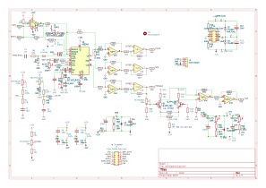
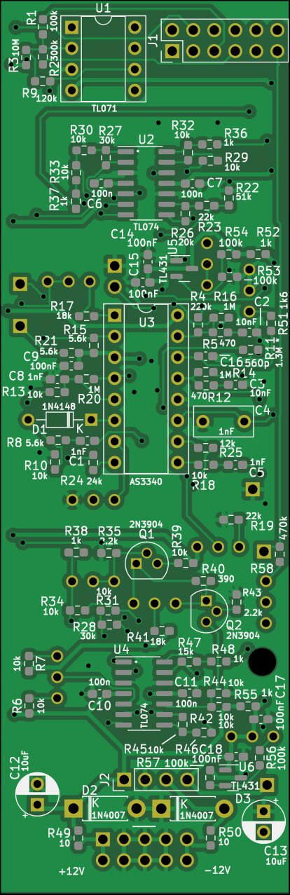
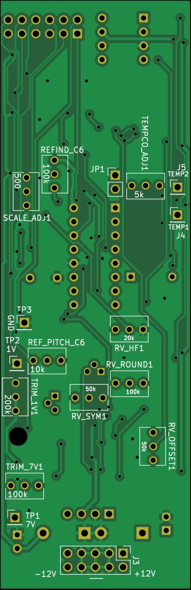
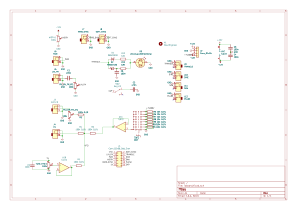
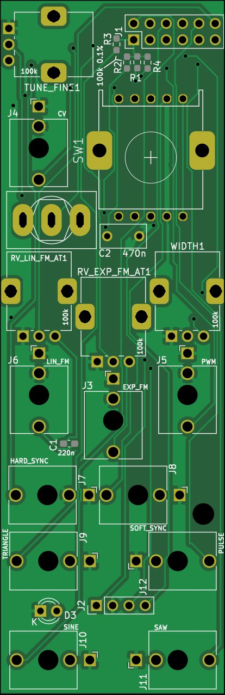
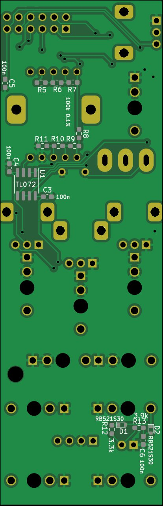
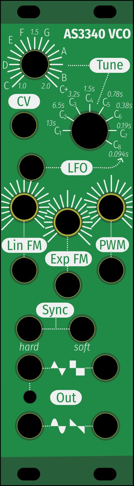

# AS3340 VCO

This design is a VCO based on the AS3340 chip, built up from a combination of designs found on the internet, resulting in the following features:
- Compact size
- Octave selector
- Holds tuning over time and temperature
* Precise finetune by note
* The usual linear FM, exponential FM and PWM inputs

## Main board

### Schematic

### PCB

## IO Board

### Schematic

### PCB

## Face plate

# Calibration
- Set to lowest octave
- Tune knob to lowest (1)
- Turn off LFO mode
- Set PWM to middle
- Connect V meter between GND and 1V
- Tweak RV_1V so we get 1.000V
- Connect V meter between GND and 7V
- Tweak RV_7V so we get about 7V
- Connect mV meter between TP1 and TP2
- Tweak RV_TEMPCO until voltage is 0V
- Put in JP1 to get a stable frequency
- Observe the triangle or square output
- Tweak RV_REF_PITCH_C6 until pitch is C6 (1046.5 Hz)
- Observe the sine output
- Tweak RV_OFFSET so that the middle value is 0V
- Tweak RV_SYM and RV_ROUND so the sine looks good
- Remove JP1
- Apply +5.000V CV
- Tweak RV_REFIND_C6 until pitch is again C6 (1046.5 Hz)
- Applu 0.000V CV
- Tweak RV_SCALE until pitch is 32.7Hz
- Connect V meter between GND and 1V
- Tweak RV_1V so we get 1.000V (TODO: figure out why this drifts)
- Connect V meter between GND and 7V
- Set to octave 6
- Tweak RV_7V until pitch is again C6 (1046.5 Hz)

# Old notes on advanced tuning schematic

## Tune towards C6
- 1M8: max ~800Hz
- 1M6: max ~910Hz
- 1M3: Spot on.
- Option: Replace 1M8 with 1M + 1M trimmer. But probably just a 0603 pad is fine too, we'll replace it with a fixed value for the main cap we end up using.

- Add an LFO switch, which adds a capacitor in parallel to the 1nF main cap.
  * normal labels: C1 through C9
  * 470 nF -> x labels:   13s   6.5s    3.2s    1.5s     0.78s      0.38s    0.19s   0.094s

- Octave switch goes from 0V to 7V (8 position switch, 7x10k 0.1% between the 8 positions. Make 7V with a TL431, R1 is 10k, R1 is 10k + 10k pot, 1k series resistor, plus 100nF bypass). Test point at +5V.
- Need a buffer opamp after the octave switch, even with the TL431 in front. TL072 with +12/-12V supply.

- Fine tune goes from 0V to 1V (take 7V from the octave switch, through 470k + 200k trimmer, to 100k pot).
- Need a buffer opamp after the fine tune as well.

- Put the high frequency tracking in the schematic, but don't need to initially populate.

# Errors in rev1 boards (obsolete)

- Mainboard silkscreen has the positions of values for R28 and R31 swapped. R28 should be 30k, and R31 should be 10k.
- Mainboard R41 should not have been to ground, it should be to -12V instead. Solder it to the left pad only (pointing left), and wire the other terminal to the bottom of R7 (which is -12V).
- IO board tune pot hole needs to be 7mm, to accommodate pots that are mounted
