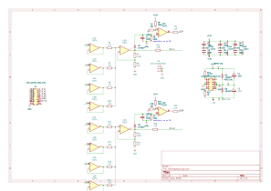
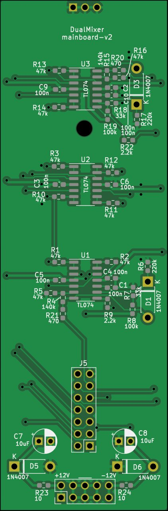
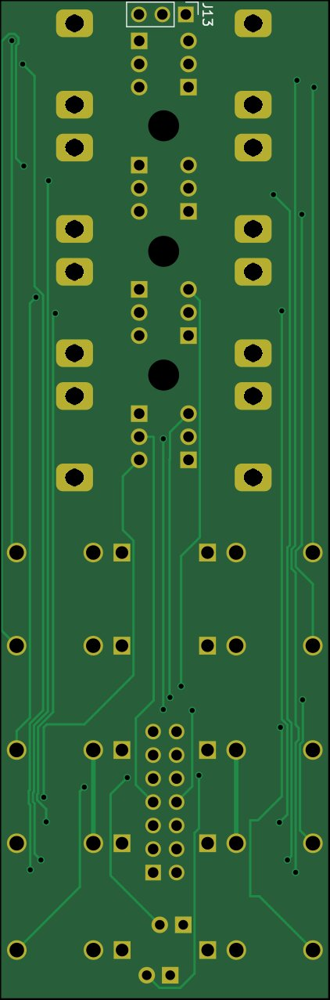

# Dual 4-channel mixer

Based off a variety of simple opamp circuits, with the following design goals:

- 4 inputs per mixer
- Individual buffers for each input, to limit cross-talk between connected oscillators
- As close to unity output when one input connected and fully opened (hence, output A can be connected to input B1 for a 7-channel mixer)
- Peak LED for each output

## Main board

### Schematic

### PCB

## IO Board

### Schematic

### PCB

## Face plate

