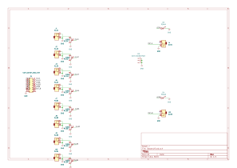
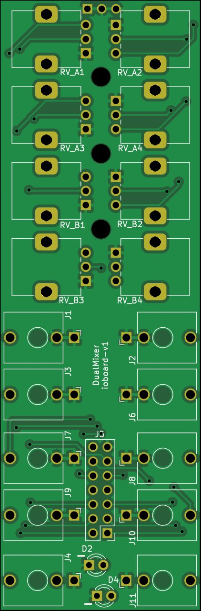
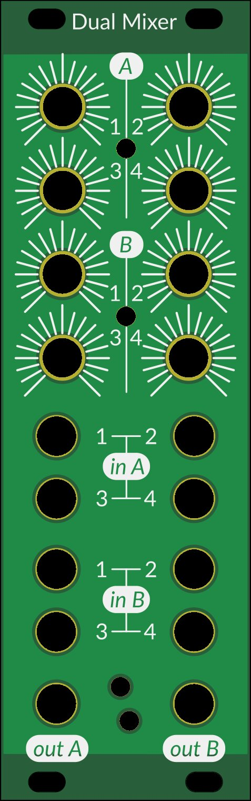

# Dual 4-channel mixer

Based off a variety of simple opamp circuits, with the following design goals:

- 4 inputs per mixer
- Individual buffers for each input, to limit cross-talk between connected oscillators
- As close to unity output when one input connected and fully opened (hence, output A can be connected to input B1 for a 7-channel mixer)
- Peak LED for each output

## Main board

### Schematic

### PCB

## IO Board

### Schematic

### PCB

## Face plate

# Simulation

Simulate this circuit on [circuitjs](https://falstad.com/circuit/circuitjs.html?ctz=CQAgjCAMB0l3BWEAOM0CcAmSAWMA2SAdn3xLCQUhEuoQFMBaMMAKB0nRB3xxAGZsNQgKH8o0fCGb9omHOhyYE-fkXSQw6FhMiZ+YeEeN6orAEo0wmEJmTIrNzERvVqHcK6gSEFxwIQbBGsBfAc3bmpmLzdoX0t+XAEk+WpEvmoIQzgab1jfAHdkvnTuXmKzIp4S-ikcQQFayu4G1TqG+tdWKo6GhBIWrqL+9qCBwTdumnGhBBEJswAnaakFshsFtMS4PyJA0Ic9jeQM7w9ovJ9d-dKj23tLjxCImF8OLiIktpQc7-EYKQyaAuQjITAETDoBDIIiqXT6bImYxDECfEpCdaiSbLZCtJq4mx4KSZDjwVg4joEFAddDE7ifHYAc2phNpLP8kyKBMaUmQvyakCm3KJIDCDhFgqKYu4VOl-H2ktFD3lNjRARR3O+yDZ30FAHkUDqmlgHLqzAATdlahrOJzgAByeBwyCFNpc7Ow4VdTkgDm0Pq9AGMQP7bL6QyFbd40EjY2AmEQaJINPoYRQ4NYwOFYJpySGBp781Io9RMNgyUVQ4X0AXw4LmVX3VWHpMGwWmwWW2Z3uA4A4tDYWEkB+AJID9BgFIQs2B+Cd1ImYHoDLHkWZLIY5uARJupGAcKd3JkYlcN5At2W+LvbB4Iudnnk4lNsg5q7Wvct0FhwAMTT+6YiOyft+YC-t+bKZMYrANnY-6GnuAzYuAhhXiBWaoV4ZY7BCyEnOAIHyP2342Oa9AAGYAIYAK4ADYAC6MDR9CWhALywGwzLWM6+GDoRN4vHmIzcGymJTmcDKKpiazumJ9YrMJUgIAeCl5NB8lKXwGk0MpSFCVpmJae4EmCQMCDfgZ35GWSzJ6d+WlmTEUyiSJ7qGU5rnKRZKIvnBX6DohrAAPa2OIrHcMgpBhhIYVXiUth0pgqysEAA)

# Notes for boards v1 (Obsolete)

The level pots go in the wrong direction. Fix: Mount I/O board the wrong way, and connect the unconnected top left pin of the dual header row to its right sibling(ground). This will reverse the A/B output LEDs, but that's fine.

