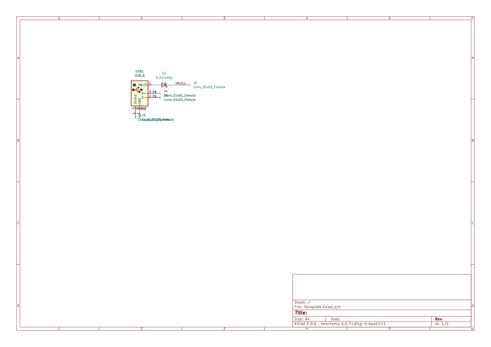
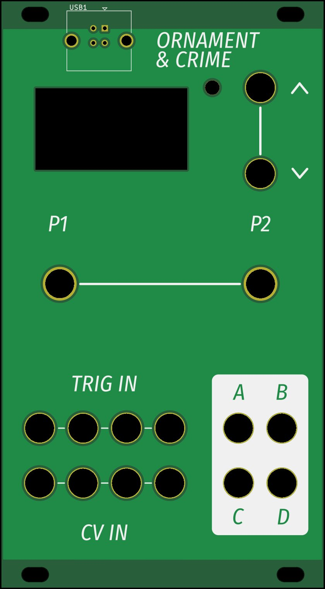
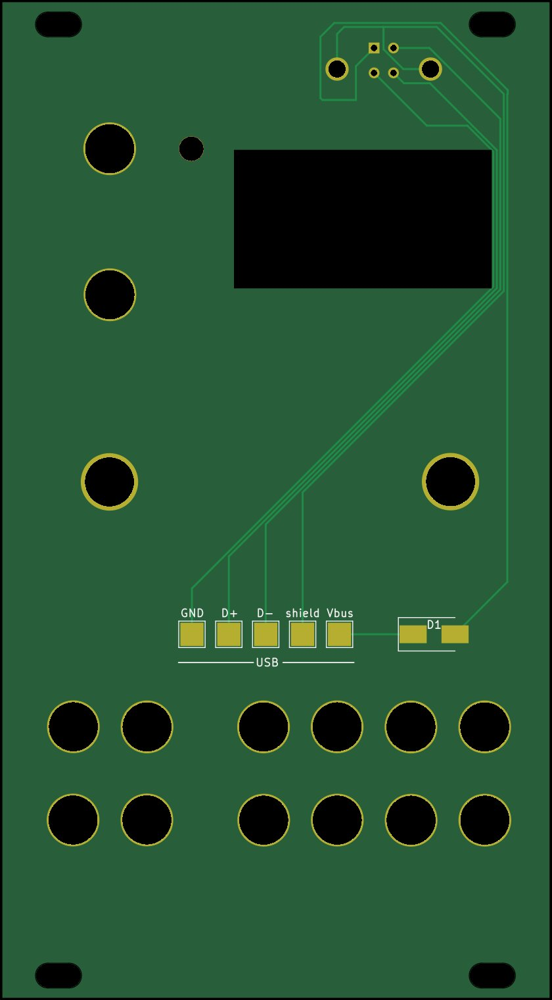

# Ornament and crime

From [https://ornament-and-cri.me/](https://ornament-and-cri.me/), where a full description is available. All functional PCBs are used unchanged.

Changes by me:
- Added PCB front plate
- Normal, cheap, 6x6 tactile buttons can be soldered to the current button footprint by flattening the legs. A [Cap](https://cad.onshape.com/documents/e7815c3b6a7c64ea29c56868/w/138a4ec4b4cdb0bee4855473/e/5fd778d5bc32cc2b5d2f75c1) for standard tactiles is available on OnShape.

## Faceplate

- A USB A header was added to allow convenient use of MIDI firmware, and upgrading. Vcc is connected through a Shottky diode, to (hopefully) prevent double-power issues. So far, powering and uploading firmware works fine through the diode.q

### Schematic

### PCB
Front:

Back:

## To do

- The current button footprints are very specific, and I haven't found alternatives for the (expensive) original buttons from mouser. It might be a good idea to change the footprint to more widely-available 6x6 or 12x12 tactile buttons.
