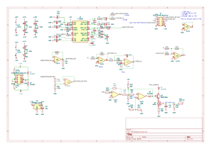
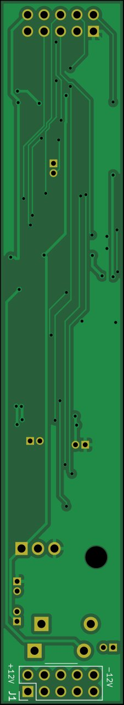

# PT2399 based delay

The schematic for this version is based on the [Encore](https://github.com/m0xpd/encore?tab=readme-ov-file) delay module. However, I've removed the VCA's and simplified the connections so it fits in a 20mm wide small module.

## Main board

### Schematic

### PCB

## IO Board

### Schematic

### PCB

## Face plate

