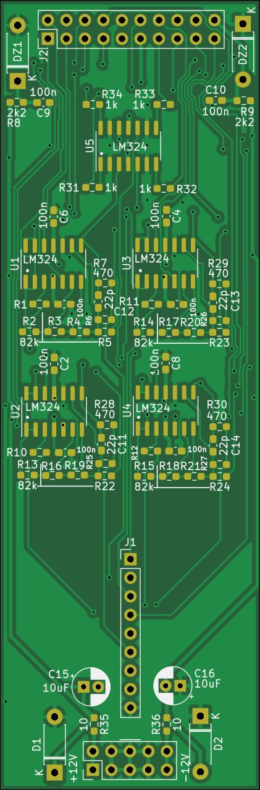
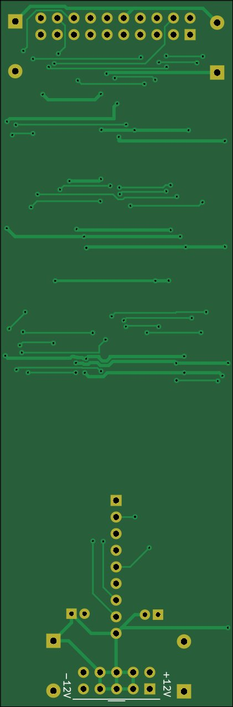
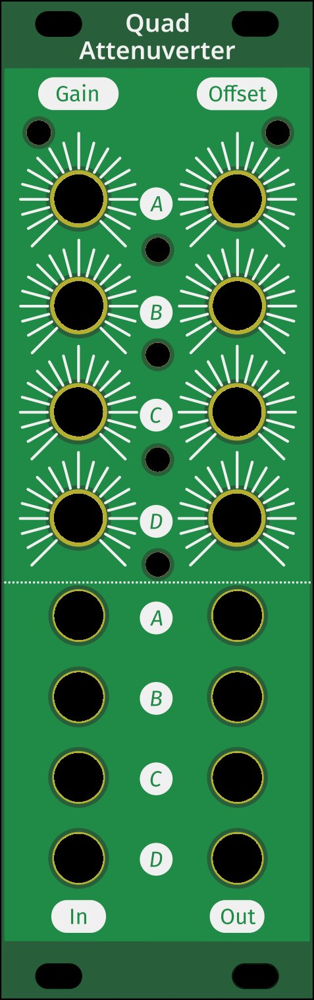

# Quad Attenuverter

Based on the design by `[Grumble]` from [synthforum.nl](https://www.synthforum.nl/threads/3811825/page-2), with the following modifications:

- Redrawn in Kicad as a main and io-board
- Made potentiometers more center-sensitive through extra resistors
- Added PCBs for main and io-board
- Added a PCB front panel

## Main board

### Schematic

### PCB

## IO Board

### Schematic

### PCB

## Face plate

# Simulation

A simulation is available on [circuitjs](https://falstad.com/circuit/circuitjs.html?ctz=CQAgjCAMB0l3BWcMBMcUHYMGZIA4UA2ATmIxAUgoqoQFMBaMMAKACURcAWT7QkFFyrY+UcMlpiqMBCwBOnSDxH9seZaKoF4LIcRBcueTghQVCw05yjR+TLtAyQURBMTx8uIjEhjPsYPBBwc5QLADunOq8-IbGKmEcXMSqaAYpijzSBlRgZtky7Omq0cmxYPzZQiBM+VLQspFxnITGzV75EQZGBthmCBa9nZEDVB3mlp0crfFpMyZ1Y1S1Ujay03jGKAMg84IFOeCLa7qQ+oTVKJsgPmZX8TZ2xNB4xKZoKGBquB82-oEhEKdMAYHijcCDQiCAT4cQA+A2DAgvCAoIQADiAEMAJYAOxYAHNdtCKlQoTw8sZpF1waSJgswiNiHdYW47hhhhRmQIObtLrzIPJ6dgrOSGVo0HAumKRWYZUpGcTlAqLsIFYKFDKrLdxSBtFLIjr7jcrLKwgodWa8BVdUIdNNeaZjIRHYMqss8qtCg6zFwLrtec13UcvQ1TudoWUbqIo9hHjVCNBsE4+gg8CRNnw8r5YCgAqjgsDQZw0k6omCMPwIPC4H9IEgAPIAMybAGc6AAXIpqMFXcsUT3B3z1dYl2h9vq0N1iaoMYfSMORM0ISsGf0rypdP0V2L+ozUpp7lFKgzHwWRMUIT2X7nnk9s6P8B93nBP7mv4rmk2+jLW2IZCUdENKwow-KM7z-T9ILNQU9D1Y8ElIMwEjjGA7DAZ5PEEDB1A8K8OSyXN8wLeAphAZl4gVCiBGuYNBxHIpqL4YxqLtVZZ3ohdGngyY9RtGDCR4schMwRYhSQmJkF5BIxicFgGyk5DRGYNIZLCABjcjPXGFIxj6MQUGgDDSBM0zTLwRhmBqDBoGZBAED6K48yhVM61YBRiG048yFiM89UlO9PN9bztP0wLQrMTY9M5KKhiEgTIl0uKJPGQLuR07kZK6QJpOUyBAzPbL8uCqgfNPakAHtuj1Gd034NIYAgYQvU4FggA).
