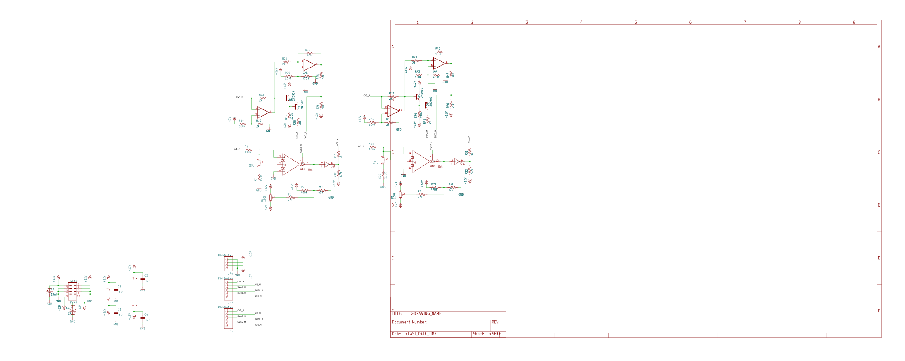
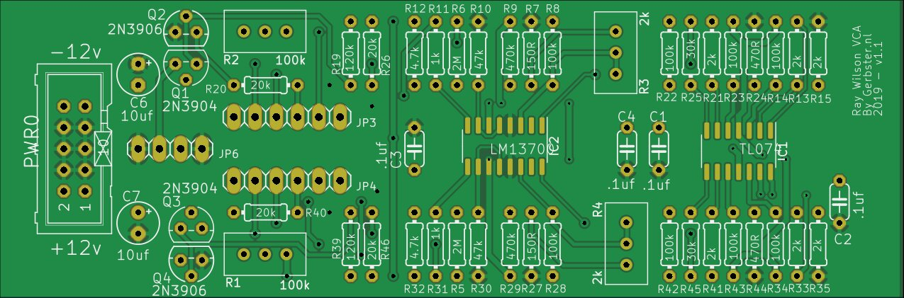
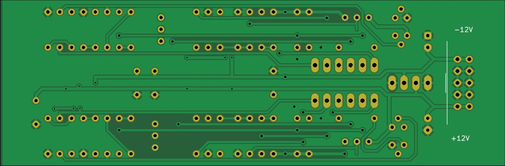
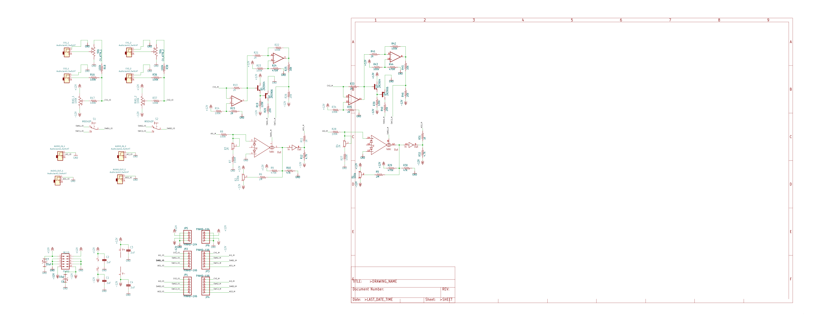
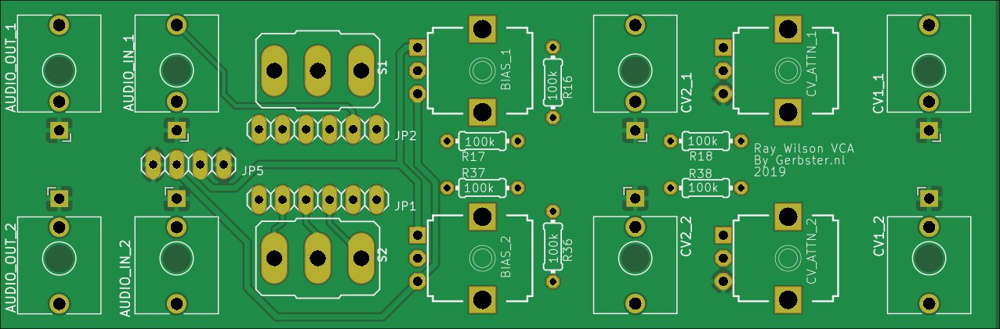
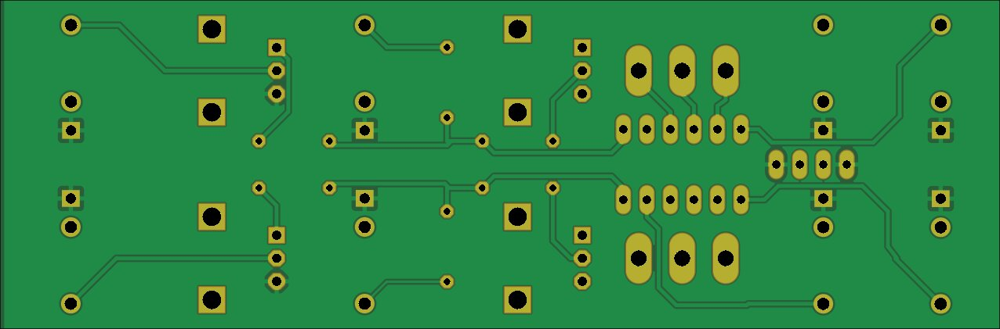
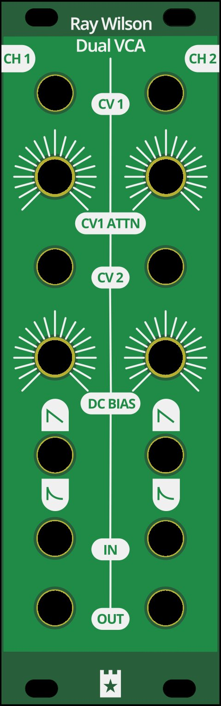

# Ray Wilson Dual VCA

Source: [RayWilson-Dual-VCA](https://github.com/gerb-ster/RayWilson-Dual-VCA/) on Github

The following modifications were made by me:

- Converted schematics and board to Kicad
- Added component values to silk screen
- Added a PCB faceplate in Kicad
- Split up into separate main and io board

## Main board

### Schematic

### PCB

## IO board

### Schematic

### PCB

## Face plate

