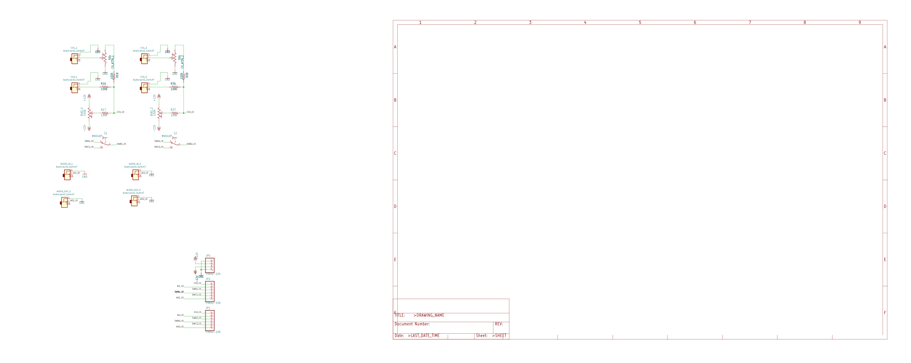

# Ray Wilson Dual VCA

Source: [RayWilson-Dual-VCA](https://github.com/gerb-ster/RayWilson-Dual-VCA/) on Github

The following modifications were made by me:

- Converted schematics and board to Kicad
- Added component values to silk screen
- Added a PCB faceplate in Kicad

## To do

- The original design combines both main and ioboard into a single schematic and perforated circuit board. JLCPCB adds an extra fee for this, and it would be cheaper there to submit it as two separate boards. Hence, the design should be split up.

## Main and IO Board

### Schematic

### PCB

## Face plate

