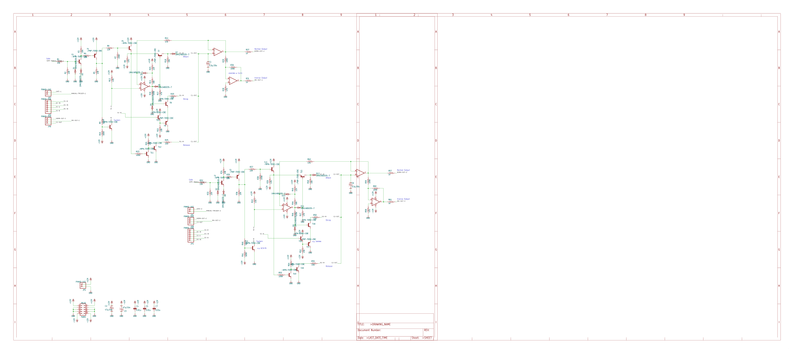
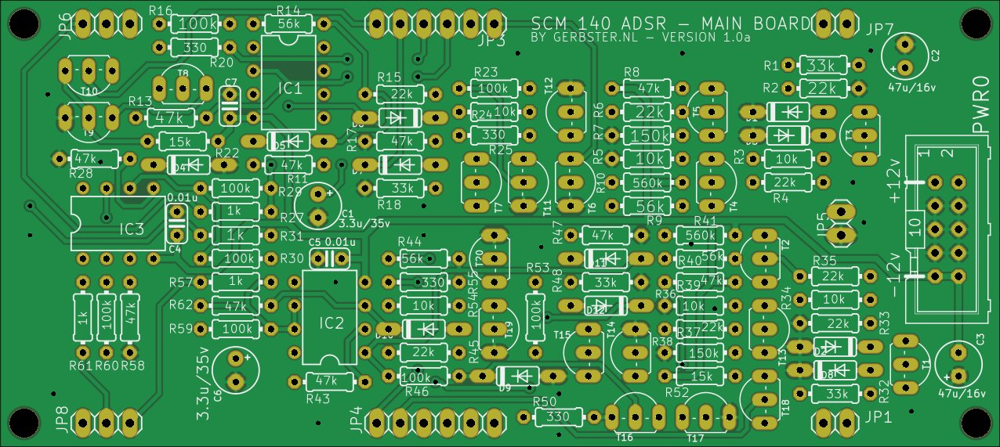
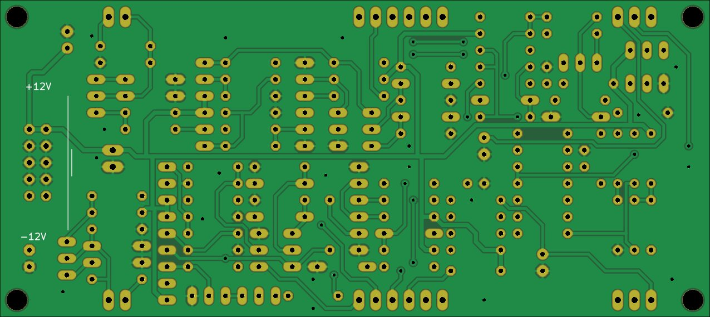
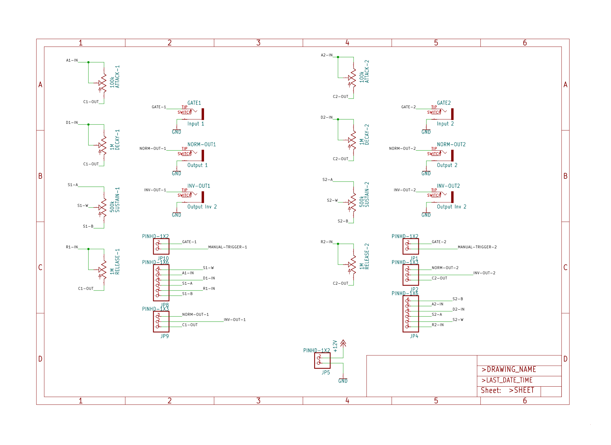
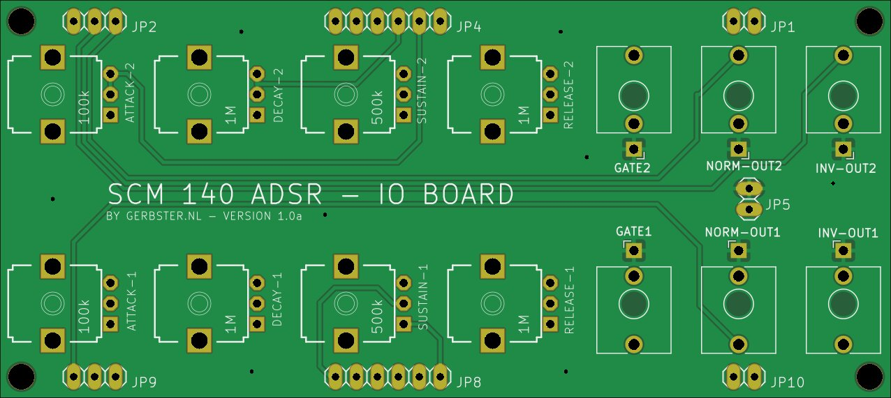
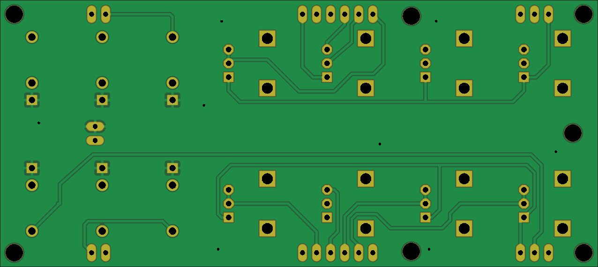
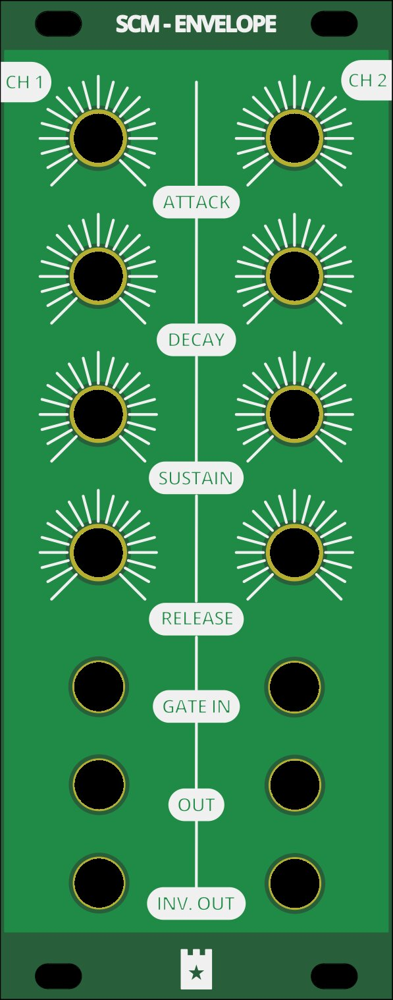

# SCM 140 ADSR

Source: [SCM-140-ADSR](https://github.com/gerb-ster/SCM-140-ADSR/) on Github

The following modifications were made by me:

- Converted schematics and board to Kicad
- Added component values to silk screen
- Added a PCB faceplate in Kicad

## Main board

### Schematic

### PCB

## IO Board

### Schematic

### PCB

## Face plate

