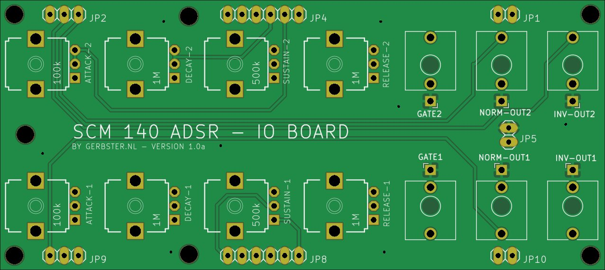

# SCM 140 ADSR

Source: [SCM-140-ADSR](https://github.com/gerb-ster/SCM-140-ADSR/) on Github

The following modifications were made by me:

- Converted schematics and board to Kicad
- Added component values to silk screen
- Added a PCB faceplate in Kicad

## Main board

### Schematic

### PCB

## IO Board

### Schematic

### PCB

## Face plate

# TODO

- Main board silkscreen is missing values, transistor types, and IC types
- IO board silkscreen is missing values
- Main board is meant to be mounted upside down (note the +12V/GND on JP5). More clear on that.
- R43 and R13 from 47k to 137k (otherwise the attack phase doesn't hit high enough until decay. Still, maximum is 9.3V now)

- Consider reducing the main cap lower than 3.3uF, envelope is too long. Changed to 0.47 uF
- See if we can add something to toggle (allow turn off) auto-retrigger

- Note: Electrolytic polarity, also for the main state caps!
- Note: NPN transistors are EU-style (BCxxx), PNP transistors are US style (2Nyyyy)! <-- check the BOM as well.
- Note: TL072 seems to have less output noise than LM4558, but that may just be a part issue.

# Simulation

A [CircuitJS simulation](https://falstad.com/circuit/circuitjs.html?ctz=CQAgjCAMB0l3BWEBmAHAJmgdgGzoRmACzICcpkORIOpISCk9ApgLRhgBQASiOzuFx9UTMEKboU9KDJjJOAJz5gBYgSMECmyZPEUgNagxIRaQ6dHoDmx86dvoskppE4ATcEWr5VXzefAAOSJiVE4Ad1sjYmojVxsYu19vJ1lOABd-aNJJOPBlTEZiSHQiHCwQ3WpWGCKENAR0MEhGrFQ-ZqYAZwAHAEsAYzY3ZgAzAEMAVwAbdIisoUS493Ac1dy1nwCwYNDOBM37ME3Ul31j3JxRNY1ReFdeC6i1olRZECJRZ1loBHO1lQmVRXGQWPSZLaA8yoN5QpjscBgaDkFGoUimdEhNasHDQdAUFQYUhYZCfEIINhYcBwEC9QbDMZTWY8aFvDToGEfN4uD5fd61eYc2F+IW2VxKUVGUVbO7WVlJeWOb6uSKSoQ6VRCdD6DX+XWmHkGuA65ACA0oU00T4yI3Gmy6qjaS04exnTL6kFoajm0R8UjQHBUMAIJzIBCkYMhtkB1BoVD1EokohtUiU6ndfpDVgjCYzOb29r0dWFl1mVxiahelCNFCFxqw+j3FzQZOQXRNjtIADKky66XGfQAdvNdUZdaQtCaBBPeUwZxJLMalJ85wIV+AQQv7vtZxumOu8q5MuuZ143vP8uwkSiUWgVJ1kBAkeHiSVSER0OUQzg2LCaTmmTmXgz1sEDXnea0wGVKBfn0ECOEkeDNw+LA5SQ-dwMPeZ4KgrlRFw7VIlefDEI0ElJyIwxcPDXJcKPK1RD8R1EVyZQ+BgeBdCg1Bg3KNF43qCp2NgOBLAQYgcGQdApMaShYn-Rk83mGiWJoUpVPFGhOQQrTYXEC09EiUtVJwbS6JWJwSJAXBYQIoIQleeZTNsyRLI0ndnP8TzLG5KBOArazTNU2NaNYzp4Bg0h43Cjs4AgABBdJ+wGABreYRFXYwmFudKaTIoKcsiGzbGKnTXEsOgYSsqr-GbJspJvRrGqpDiEEadEw3qXQYVaJBRHSqTgqoyRtU+Oh32oGdOnPVQYIEK9oFNLBBM+DLTT62BpIgFUQAmoarJ2vaNByNkzkiE7bAulQ-MiZp1Ouu7Joo6l1KmuAZpul7YmnDkNz83hiQEKhdvVaDIOggUAcWX7Ab3CD4Ton4-iUK61ymsxW2NXgED8U03hx6h1x5a12Ah2DsdxyBvRFU4ZHB-lYLG+hcP1dVLWQObhKIHHTFwVDpMoQWWs2x9Yo7ZxlJZywPhnKSzplgRSn3dG-I8FSlYV8xrVyXZHKUdXrRU3UmFtZS2bNNZdW1fXNkNgF9LBLH6Hti3cj8Ym+R5AU1ct51rSt+y9iMyCmP9y1NOYh1rSJlC5WY9d4+us4bckfUXkG2U9B9xDgZUkgRsDxybDz3OXluPzMmM-PdI+DPL1qcSMFQWg2w5LiOZqX5A1W7qiCippUk6EAAKUyI88GqvBut2tKxrKsZXARg9F4ef7Hn9SPfAMm-kiKsw0kcTU5rQjNY1vuBDl8wMhoewCZru+Ed22AeNjLqcDusgqX9SAOAnNtQ0oPGeSTAR7MiMpyECnl6xX0rupaBzFoG+lYJgHQBAlq4HqM3KmWhfgYCkm0VAJICDkB4umYeilmS8AQbheO5d9yeyRk5Q2TFb7uycnA361doEny4ZwwaIEdrVzAjSARnAAAeKBSAcw-FSV4EASD7i1iAHsfYBzDgkRUDmxAOY8ToBJD4SjErJTSkoBBIJmJ4GoKIJe8QGJqWoBY60ZwbBQPMZyFSyca4hAEMVbxMgdCuA0SQFA5QDBgDeMgVCBj1IABFmADHGAAT1ytoQsxUqw7QyruLJGT-JCV8ddEKHwHrpnuJFaKYt4AQDiQk5JRUgpVgKc9IpOkil+NcAAeS+rtVQkBOQXlsTVIwNUfJpGDibUOJsQTakyOaciztXLh3rgGFQIQf44xkhOd8NBsCfB0OiKm5A4DkDTEPUBcx9YgnmcRaySyYqaRUm5FSxlM4PAWTfV29j4ZbwZn8Su1o3LlFctLX0tQoqfBUGGSA75iTgRgO-IMfS24vmOHohSuYwF2KeWsNytjHk1keUFZxNBUjzKBYFXyEdSVUwpdZGlTpyz5KCqhagRSWX5Huc2cgNjKkQG4MwaYzBxhdGYCkmuWTyWZJpOS4qkrxHWWCS6JAsYgYEGidQflgrhWivqW8GVzL6UDUQoUwa7LXAAHsZZWjptCv8MF4BtCgn1aQfcpDNA5l7fxnAgA) is available.
