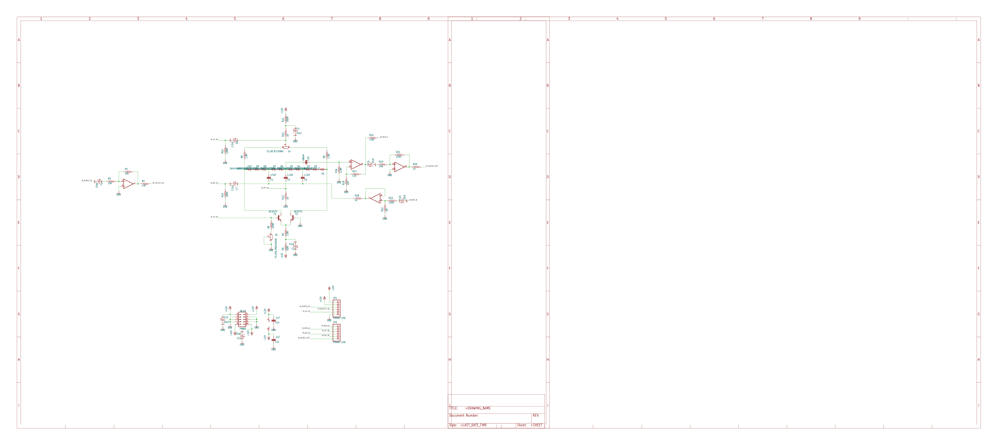
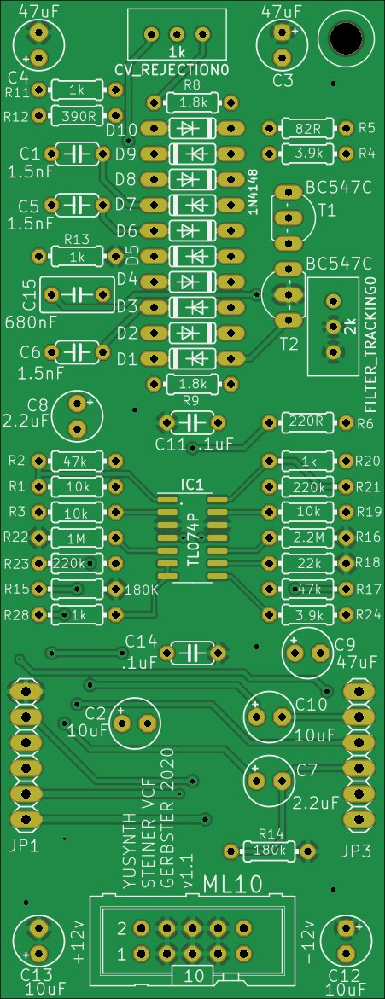
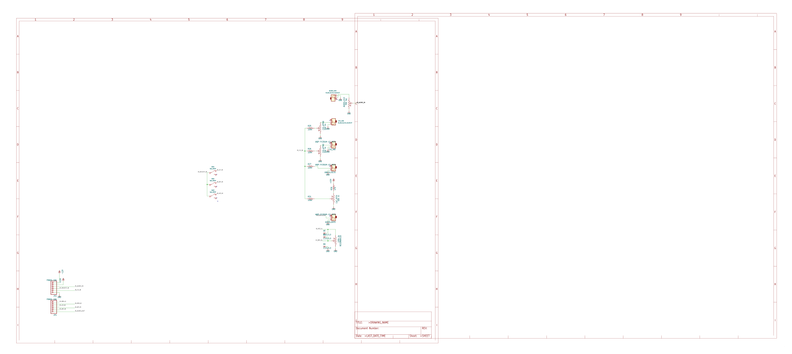
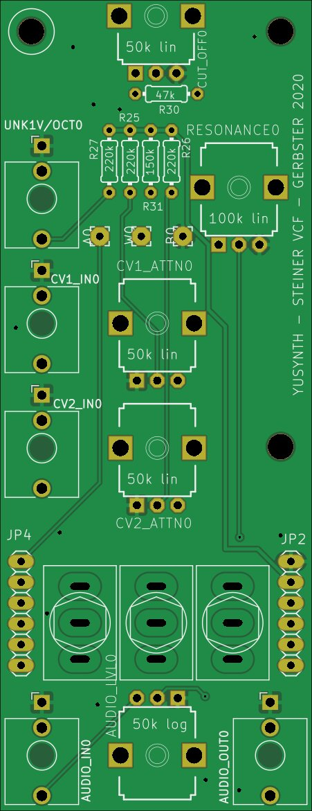
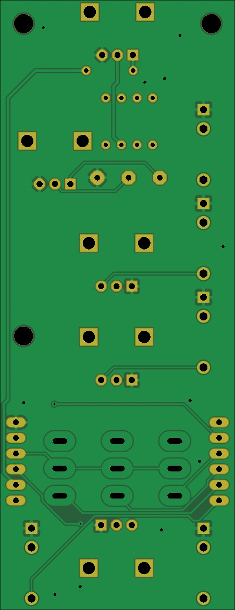

# Steiner VCF

Source: [Steiner-VCF](https://github.com/gerb-ster/Steiner-VCF/) on Github

The following modifications were made by me:

- Converted schematics and board to Kicad
- Changed TL074 footprint to SMD. since that's actually available
- Changed filter selection to simple switches instead of the fancy microcontroller
- Added component values to silk screen
- Added a PCB faceplate in Kicad

## Main board

### Schematic

### PCB

## IO Board

### Schematic

### PCB

## Face plate

