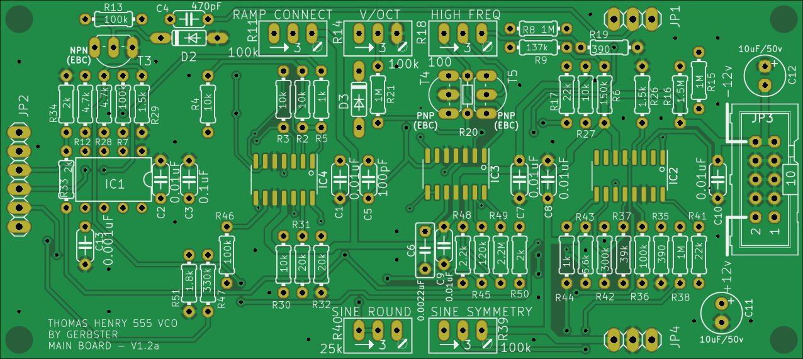

# Thomas Henry 555 VCO

Source: [TH-555-VCO](https://github.com/gerb-ster/TH-555-VCO) on Github

The following modifications were made by me:

- Converted schematics and board to Kicad
- Replaced footprints for TL074 and LM13700 to SMD (since those are available on LCSC)
- Added component values to silk screen
- Added a PCB faceplate in Kicad

## Main board

### Schematic

### PCB

## IO Board

### Schematic

### PCB

## Face plate

# TODO

- Mainboard silkscreen is missing values
- Mainboard is missing mounting holes (ioboard seems fine)
- Mainboard is missing silkscreen for ICs entirely
- IO board is missing silkscreen for C1
