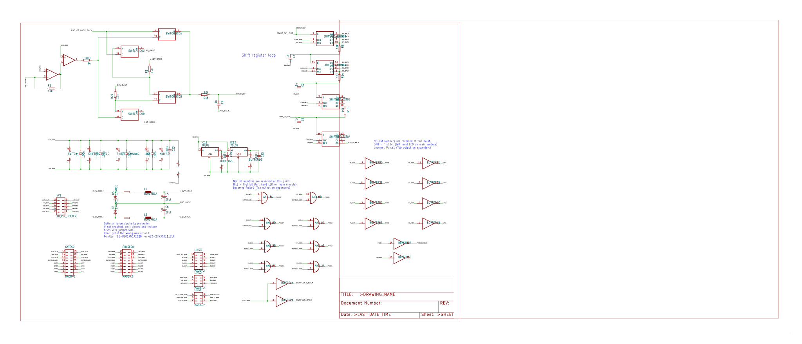
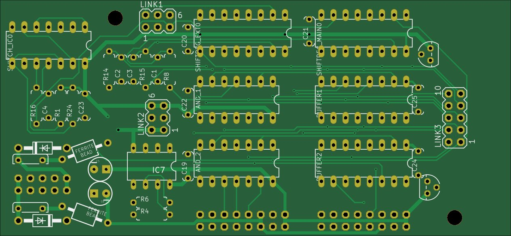
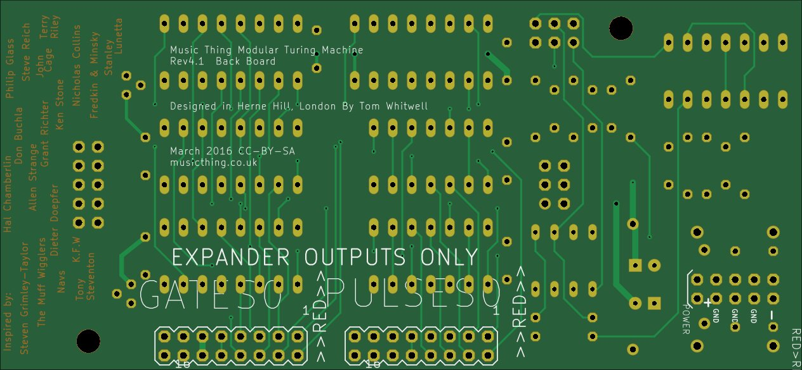
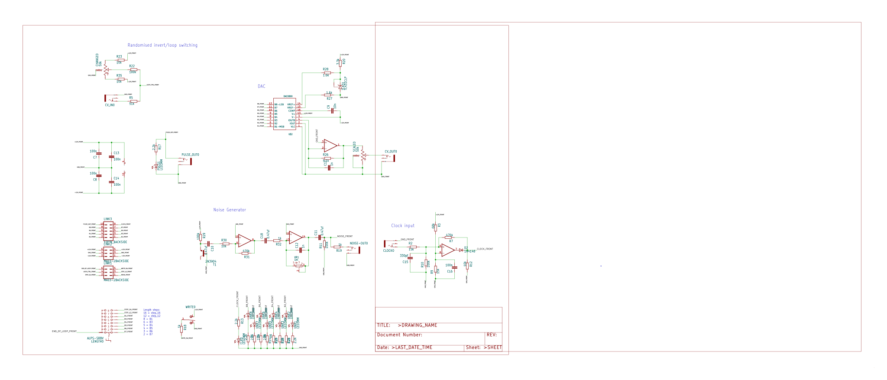
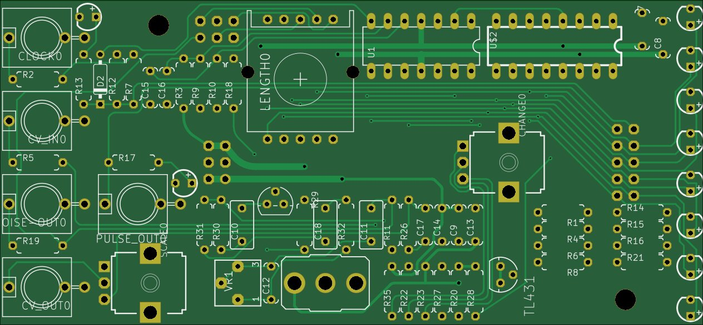
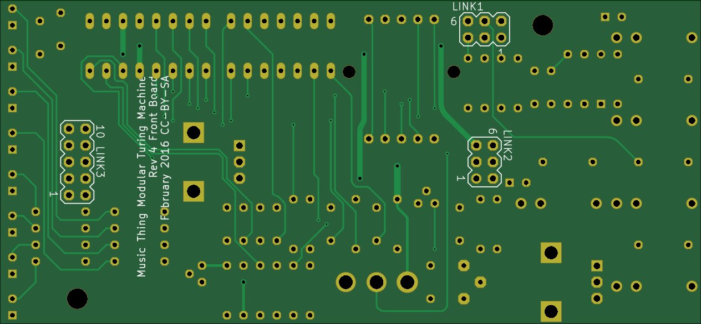

# Turing machine

Based on [[https://github.com/TomWhitwell/TuringMachine/][Turing Machine]] on github.

My modifications:

- Converted schematics to Kicad
- Front panel isn't converted, since Eagle source for that isn't available. Only raw gerbers exist.

## "Back" board

### Schematic

### PCB

## "Front" Board

### Schematic

### PCB

