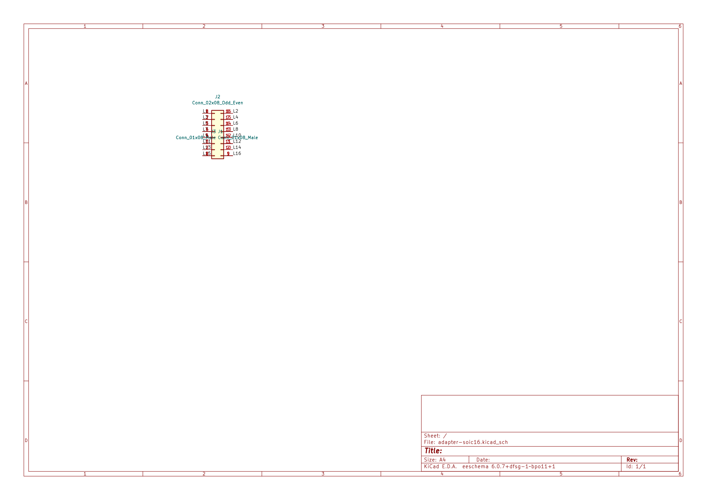
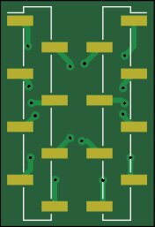
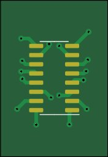

#  SOIC-16 to DIP-16 adapter

A simple adapter board that allows you to mount an SOIC-16 in a DIP-16 socket. One side uses SMD headers, so the other side can have a SOIC-16 footprint.

This was designed since some TuringMachine parts turned out to only be available in SOIC, while the boards were already manufactured with DIP sockets.

### Schematic

### PCB

