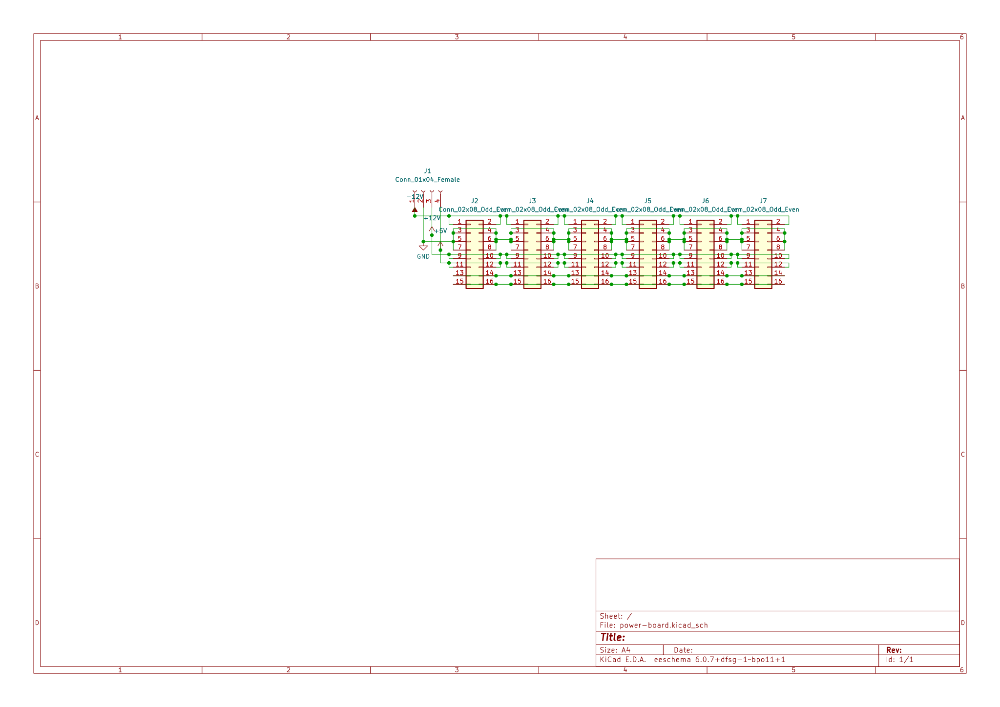
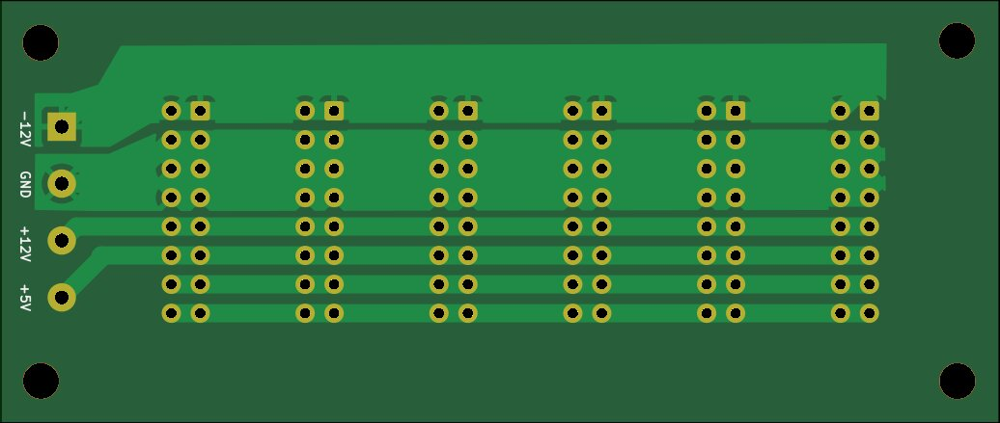

# Power distribution board

A simple power distribution board with 6 16-pin IDC connectors and a 4-way screw terminal. Silk screen contains markers for 10-pin IDC connectors as well, for modules not using the +5V (none in this repository do).

### Schematic

### PCB

# TODO

- Mounting holes are missing!
